# Remote Desktop Access Troubleshooting Lab

## Objective
Simulate and troubleshoot a real-world IT support scenario where a domain user is unable to access a Windows Server via Remote Desktop. Validate network connectivity and service availability using Nmap, identify the root cause related to user authorization, and restore remote access by applying appropriate permissions.

---

## Lab Environment
- Windows Server 2019 Virtual Machine
- Windows 11 Pro Virtual Machine
- Active Directory Domain Services
- Group Policy Management

---

## Ticket
User reports inability to connect to a Windows Server via Remote Desktop using domain credentials. Connection attempt results in access denied error. Support ticket has been received.

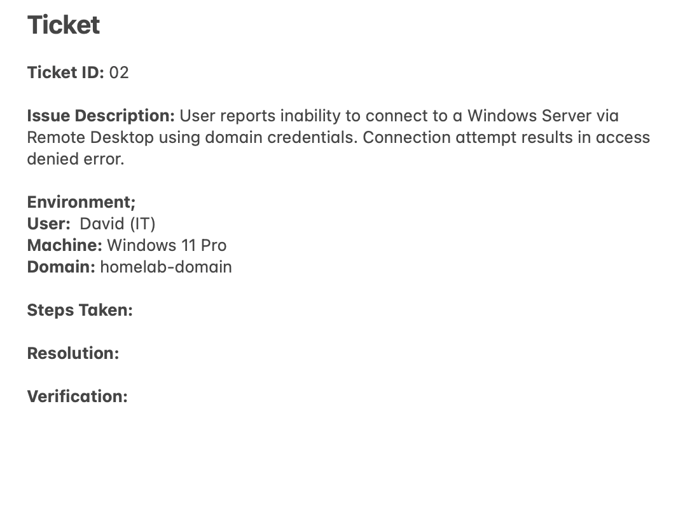

---

## Steps

### 1. Identified the Problem
Attempted a Remote Desktop connection using domain user credentials and received an authorization error.

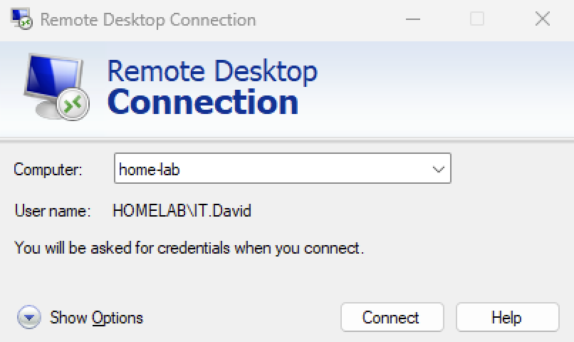

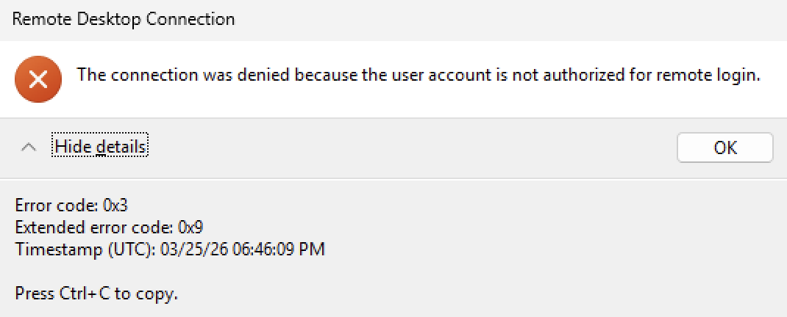

---

### 2. Established a Theory of Probable Cause and Tested the Theory
Formed an hypothesis of network connection between the domain user and server. Tested whether network connectivity between the client and server was causing the issue by using `ping`. Received successful responses confirming reachability. 

**Command Used:**
```
ping
```

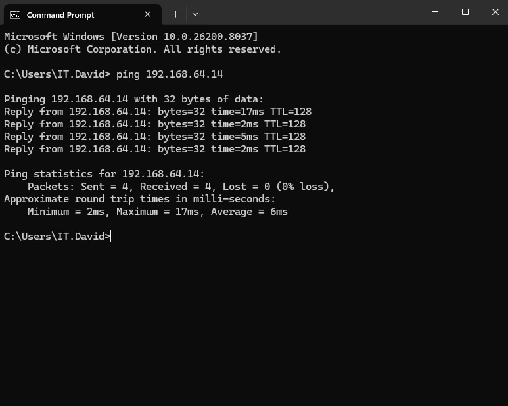

---

### 3. Established a New Theory of Probable Cause and Tested The Theory
Formed another hypothesis of Port 3389 (RDP) being filtered or closed. Logged on to administrators, Tested whether the RDP port (3389) was blocked by running an `nmap` scan, confirming that the port was open and the service was reachable.

**Command Used:**
```
nmap -p 3389 192.168.64.14
```


---

### 4. Established a New Theory of Probable Cause and Tested the Theory
Created a third theory of the user not being a Member in Remote Desktop Users. Opened Active Directory Users and Computers domain → Builtin → Remote Desktop Users Security Group properties and clicked on the Members tab and confimed the domain user was not a member, explaining the login failure.


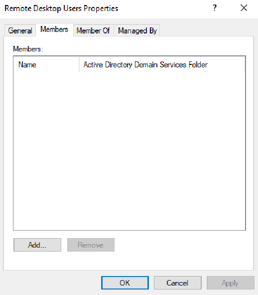

---

### 5. Established a Plan of Action and Implemented the Solution
Added the domain user to the Remote Desktop User Security Group. Attempted Remote Desktop connection again but the login still failed with an authorization error. This indicated that group membership alone was not sufficient and that additional policy restrictions might be preventing access.

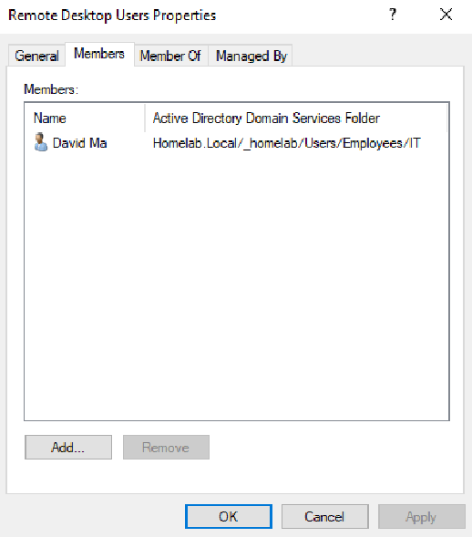

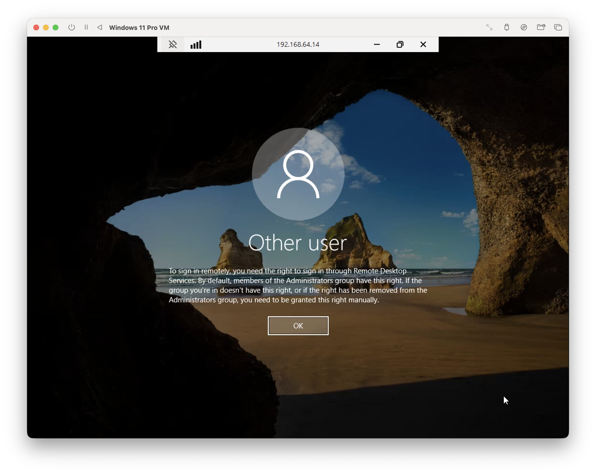

---

### 6. Continued Troubleshooting
Created an hypothesis that local policies needs to be properly configured. Tested the theory by opening Group Policy Management, opened Forest → Domain → Domain Controller, right clicked on Domain Controller Policy → Edit → Computer Configuration → Policies → Windows Settings → Security Settings → Local Policies → User Right Assignment and acknowledged policy " Allow log on through Remote Desktop Services" was not defined. Added the domain user to this policy to grant the required logon rights.

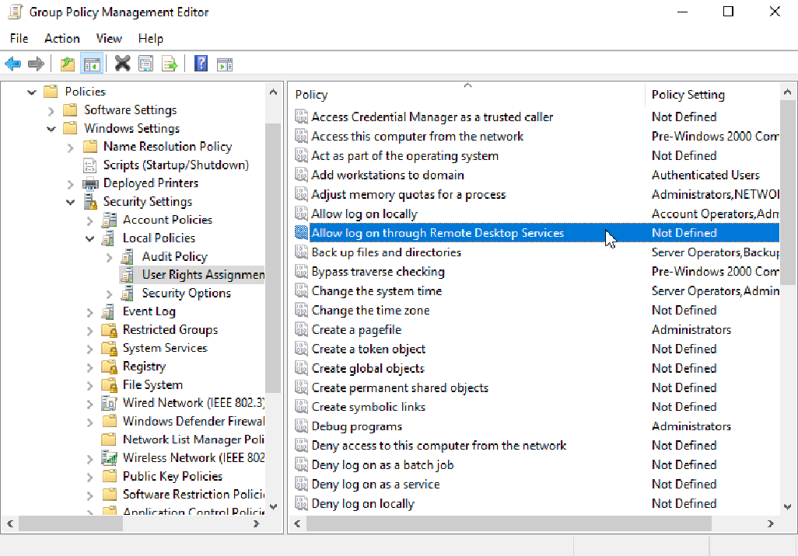

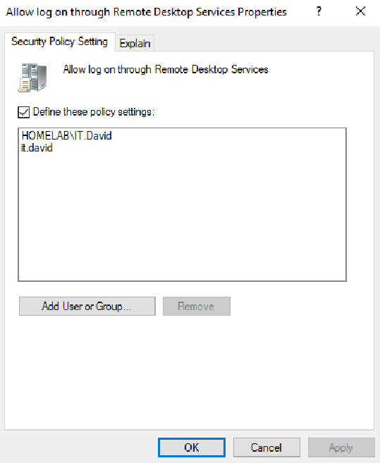

---

### 7. Verified Full System Functionality
Used command `gpupdate` to force new Group Policy settings. Verified successful Remote Desktop access by logging into the Windows Server and running `ipconfig`, confirming control of the remote system.

**Command Used**
```
gpupdate /force
```

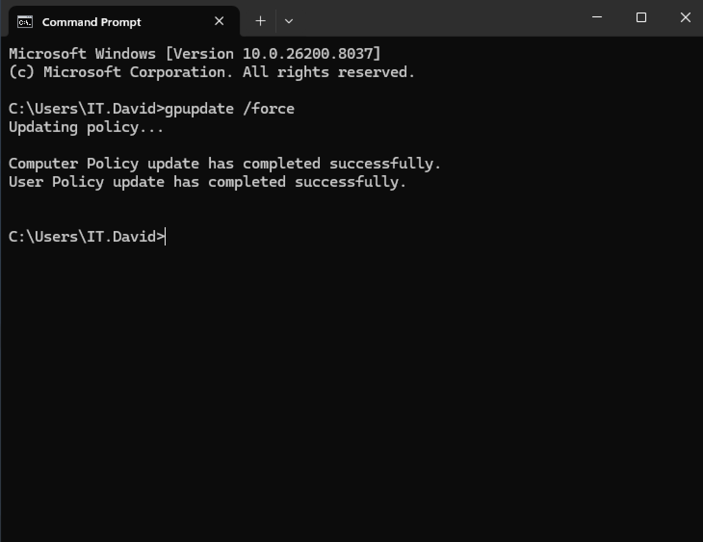

**Command Used**
```
ipconfig
```

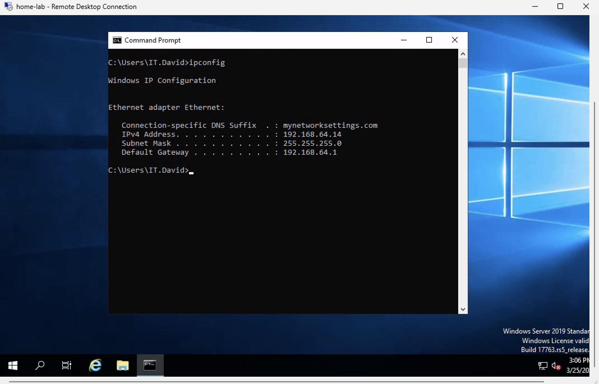

### 6. Documented Findings, Actions and Outcomes
Documented the issue, troubleshooting steps, resolutions and verification results in the support ticket for future reference and auditing. Ticket closed.

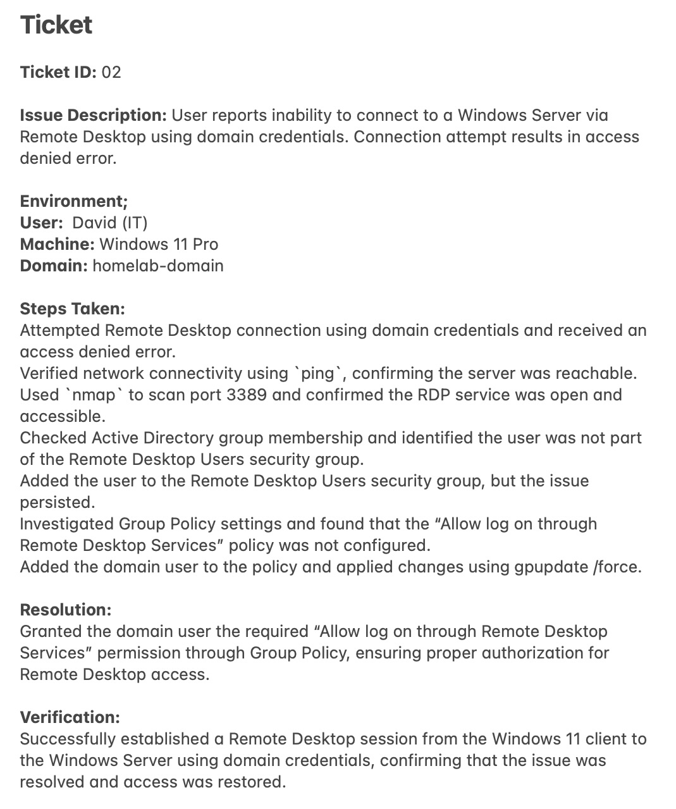

---

## Key Takeaways
- Nmap confirmed that the RDP service was reachable (port 3389 open)
- Network connectivity was not the issue
- Group membership alone does not guarantee access
- User rights assignments in Group Policy can override permissions
- Effective troubleshooting requires isolating connectivity, service, and authorization layers