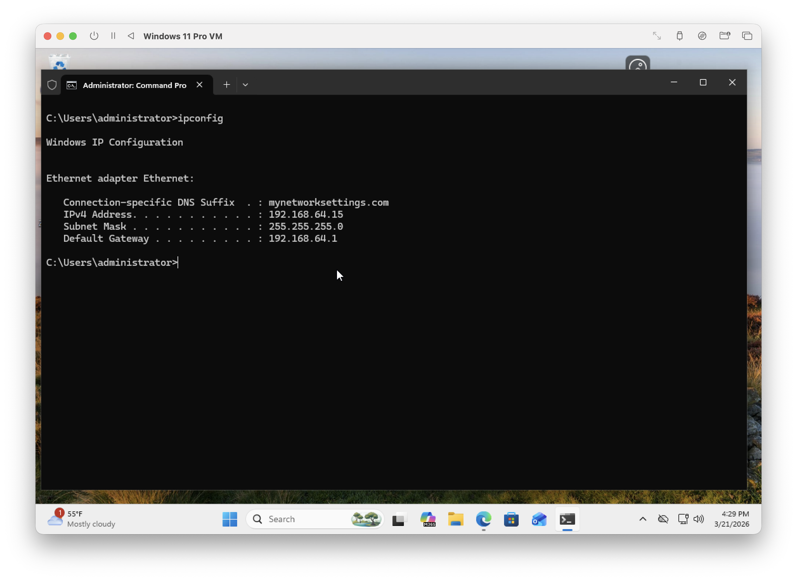
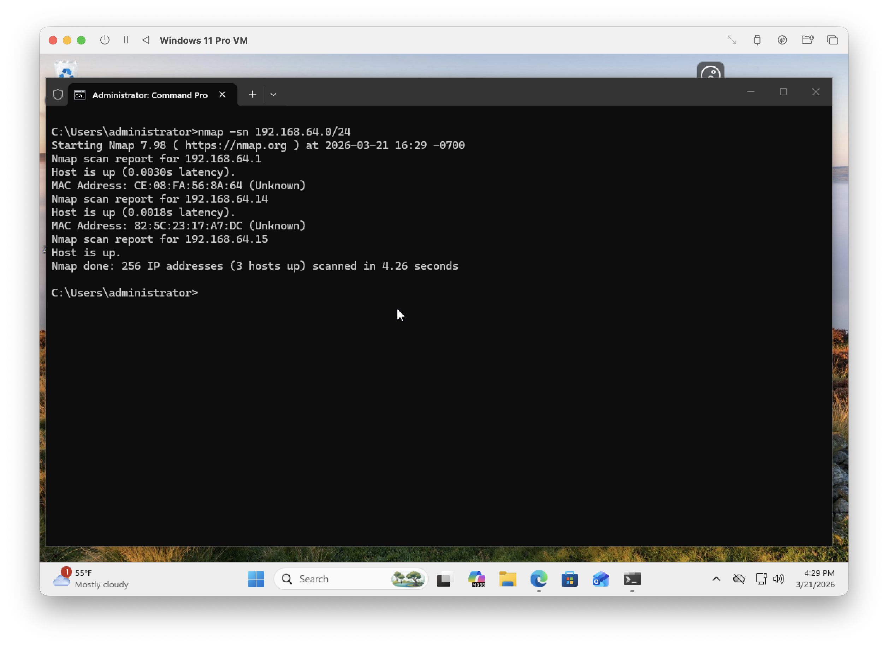
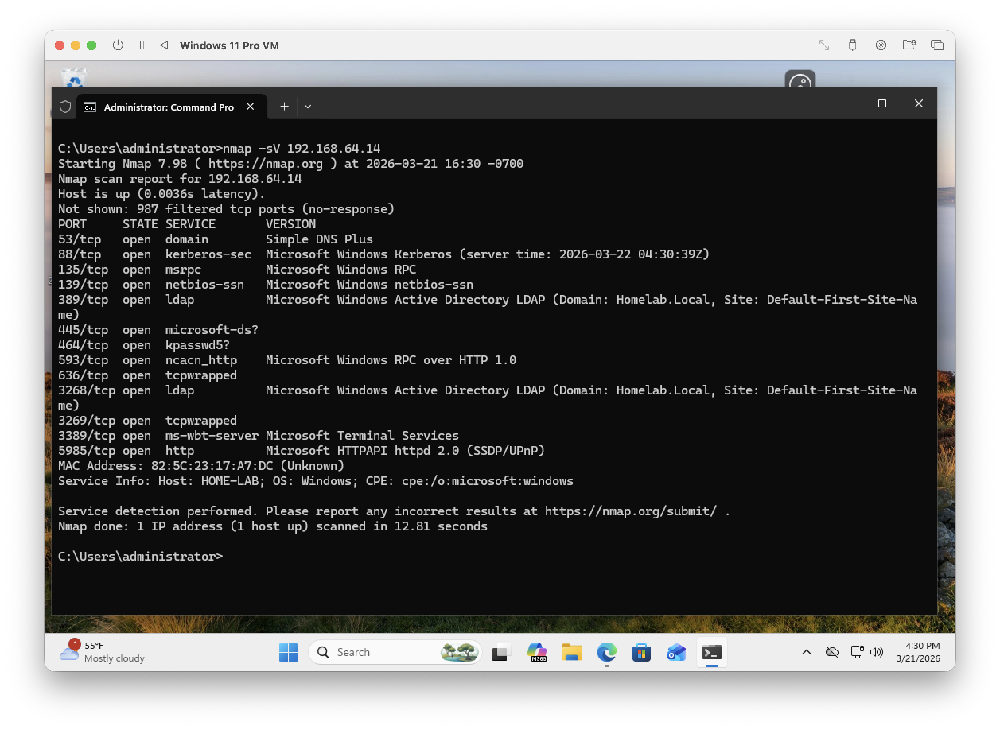
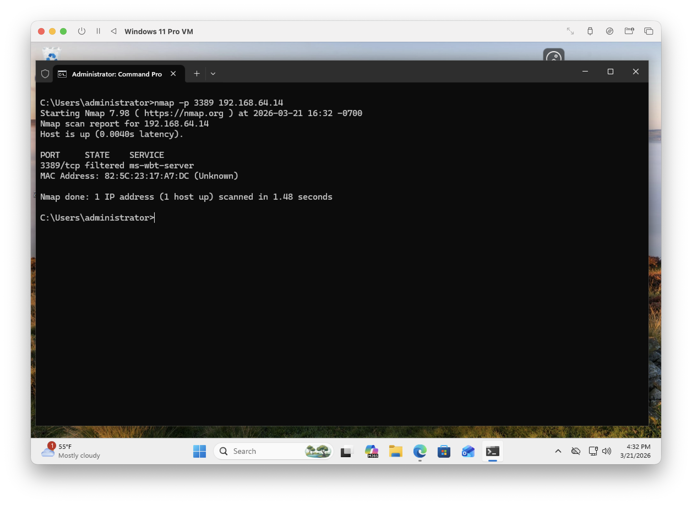

# Nmap Network Scanning Lab

## Objective
Identify active hosts and analyze exposed services within a virtual network, then validate security changes.

---

## Tools
- Nmap (CLI)
- Windows 11 Pro VM
- Windows Server (Active Directory)

## Network
- Subnet: 192.168.64.0/24

## Steps

### 1. Network Identification
Launched the command prompt and identified the local IP address, subnet mask, and default gateway using ipconfig to understand the network range before scanning.

**Command Used:**
```
ipconfig
``` 



**Description:**
Command Prompt displaying ipconfig output with the system’s IPv4 address, subnet mask, and default gateway.

---

### 2. Network Discovery
Performed a host discovery scan to identify active devices on the network.

**Command Used:**
```
nmap -sn 192.168.64.0/24
```



**Description:**
Command prompt showing nmap host discovery scan results listing active IP addresses detected on the subnet.

---

### 3. Service Enumeration
Executed an nmap scan to enumerate live hosts and begin identifying open ports and services.

**Command Used:**
```
nmap -sV 192.168.64.0/24
```



**Description:**
nmap results showing scanned ports on a target system, including port numbers and their states (open/closed). 

---

### 4. RDP Exposure (Before)
Scanned port 3389 (Remote Desktop) to check status.

**Command Used:**
```
nmap -p 3389 192.168.64.14
```


**Description:**
nmap output showing port 3389 in an open state.

---

### 5. RDP Disabled (After)
Disabled Remote Desktop on the target system via Windows Server system properties and re-scanned port 3389 to verify the change.

**Command Used:**
```
nmap -p 3389 192.168.64.14
```



**Description:**
nmap output showing port 3389 state changed to filtered, indicating Remote Desktop is no longer accessible.

---

## Key Takeaways
- Identified active hosts using nmap
- Enumerated services including Active Directory components
- Validated security changes by testing port exposure